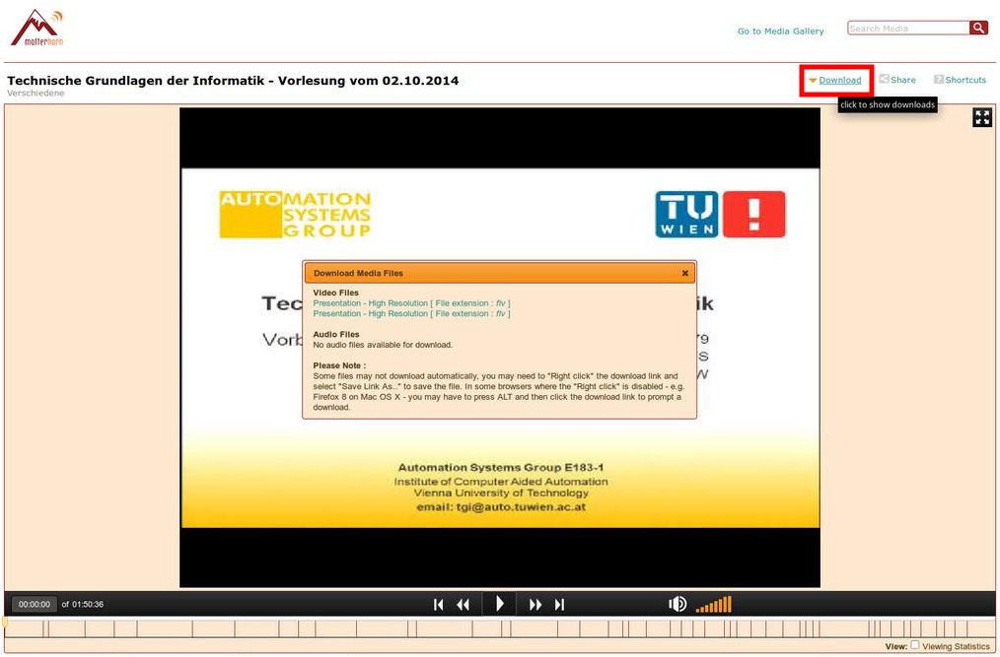

# Download from TU Wien Streaming Server Matterhorn

Greasemonkey script that adds a download button to the Matterhorn Engage
frontend [LectureTube](http://mh-admin.ltcc.tuwien.ac.at/engage/ui/index.html).

Save the script under the file "matterhorn.user.js" and install it via drag
and drop in Firefox.
[Greasemonkey](https://addons.mozilla.org/firefox/addon/greasemonkey/) has to
be installed before. After the script has been installed, a download link is
added, as shown in the screenshot.
